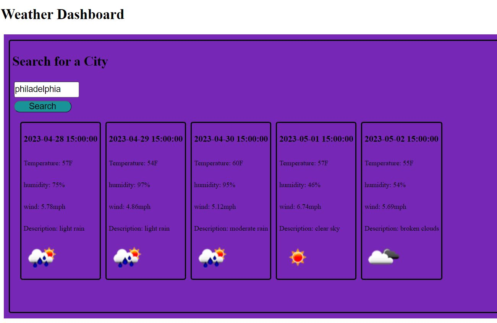

# weather-forecast

## Desciption
This goal of this project was to create a weather forecast application that allows you to type in a city name and it shows you the current weather index along with a 5-day forecast of the weather from that city, bringing the information from API's and saving searched content into local storage.

## Table of Contents
- [Installation](#installation) -- No install necessary
- [Usage](#Usage) -- Open in browser
- [Screenshots](#screenshot) -- See below
- [Credits](#Credits) -- N/A
- [License](#license) MIT license

## Installation
No install necessary

## Usage
Open in Browser. 

## Screenshot

## Credits
N/A

## License
MIT license

Copyright (c) 2023 "Amanda Whitley"

Permission is hereby granted, free of charge, to any person obtaining a copy of this software and associated documentation files (the "Software"), to deal in the Software without restriction, including without limitation the rights to use, copy, modify, merge, publish, distribute, sublicense, and/or sell copies of the Software, and to permit persons to whom the Software is furnished to do so, subject to the following conditions:

The above copyright notice and this permission notice shall be included in all copies or substantial portions of the Software.

THE SOFTWARE IS PROVIDED "AS IS", WITHOUT WARRANTY OF ANY KIND, EXPRESS OR IMPLIED, INCLUDING BUT NOT LIMITED TO THE WARRANTIES OF MERCHANTABILITY, FITNESS FOR A PARTICULAR PURPOSE AND NONINFRINGEMENT. IN NO EVENT SHALL THE AUTHORS OR COPYRIGHT HOLDERS BE LIABLE FOR ANY CLAIM, DAMAGES OR OTHER LIABILITY, WHETHER IN AN ACTION OF CONTRACT, TORT OR OTHERWISE, ARISING FROM, OUT OF OR IN CONNECTION WITH THE SOFTWARE OR THE USE OR OTHER DEALINGS IN THE SOFTWARE.

## Badges
N/A

## Features
N/A

## Tests
Tested during milestones